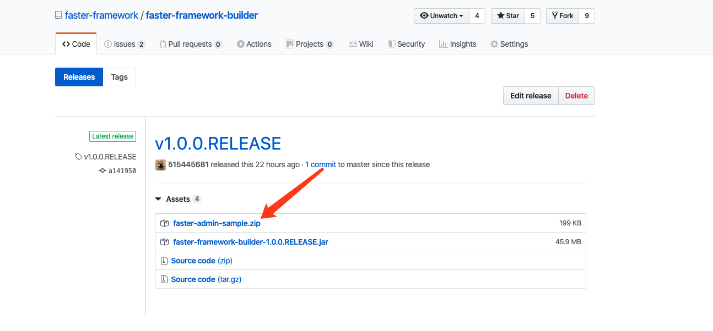
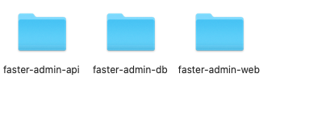

# 快速启动

我们为您提供了一份可直接运行的代码来体验快速我们的框架，但是如果您想要将框架应用到您的业务中，那么您需要使用代码生成器来生成代码，而不是使用本章所提供的示例。

首先，您需要访问下面的地址，下载快速体验版代码。

[地址](https://github.com/faster-framework/faster-framework-builder/releases/latest)

点击faster-admin-sample.zip进行下载。

下载完成后解压到喜欢的目录即可。

解压后包含如下三个文件夹。

接下来的每个小节将会一一启动每个目录中的服务。
