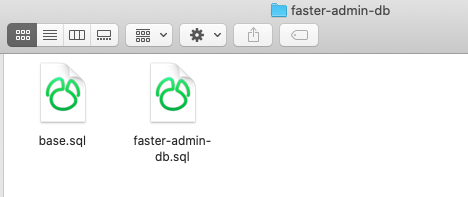
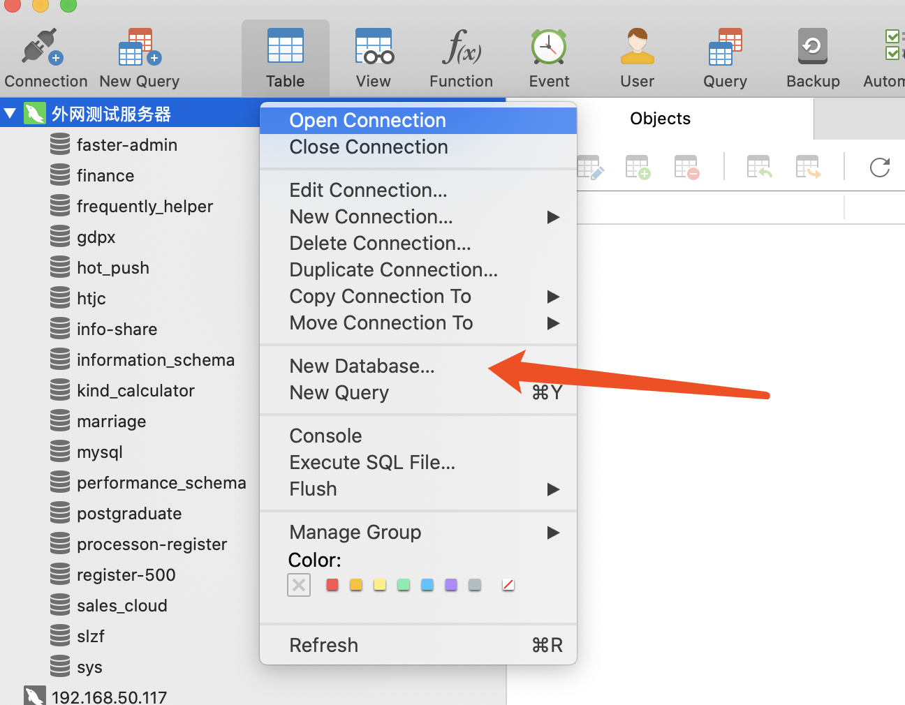
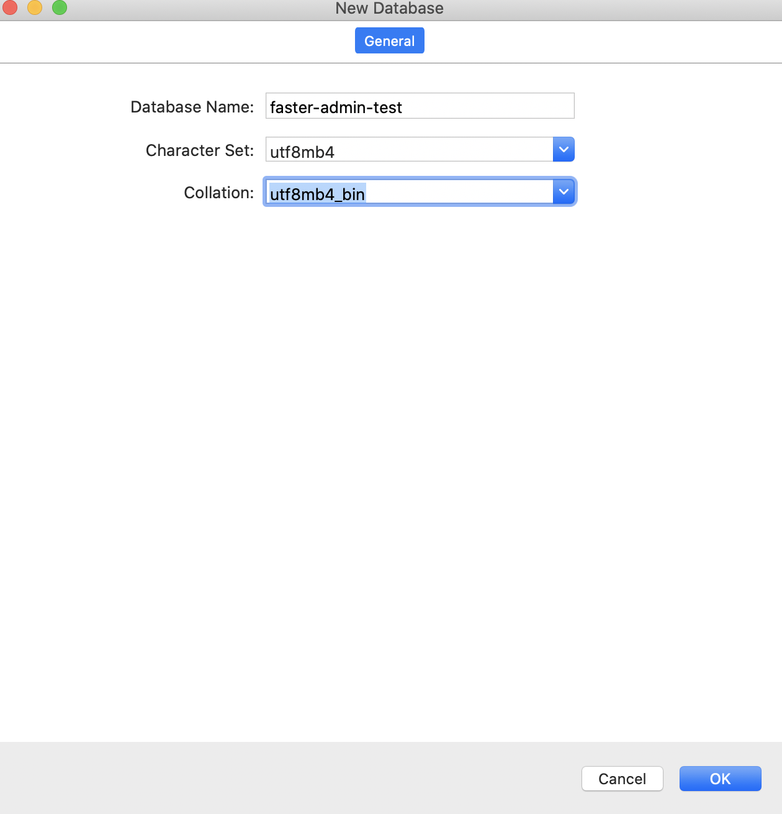
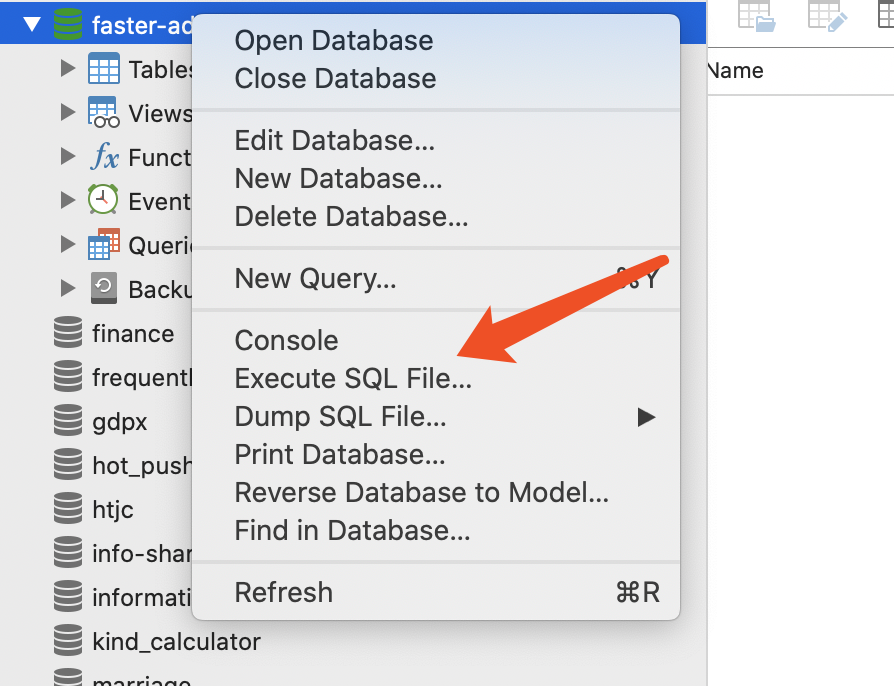
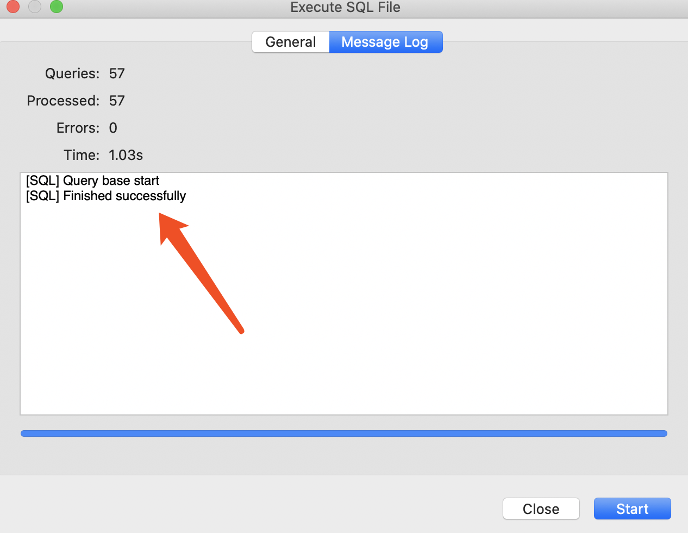
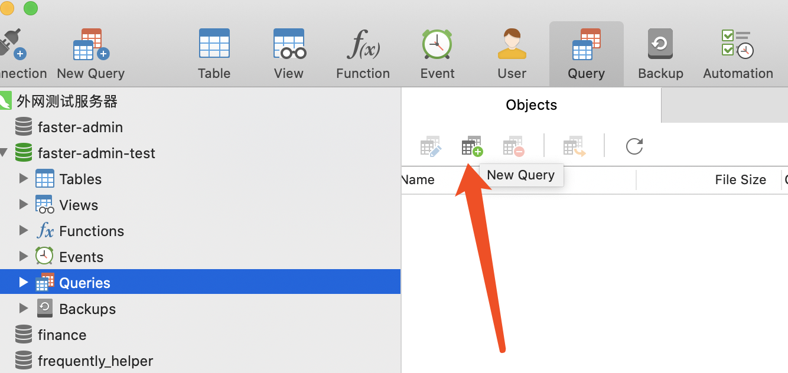
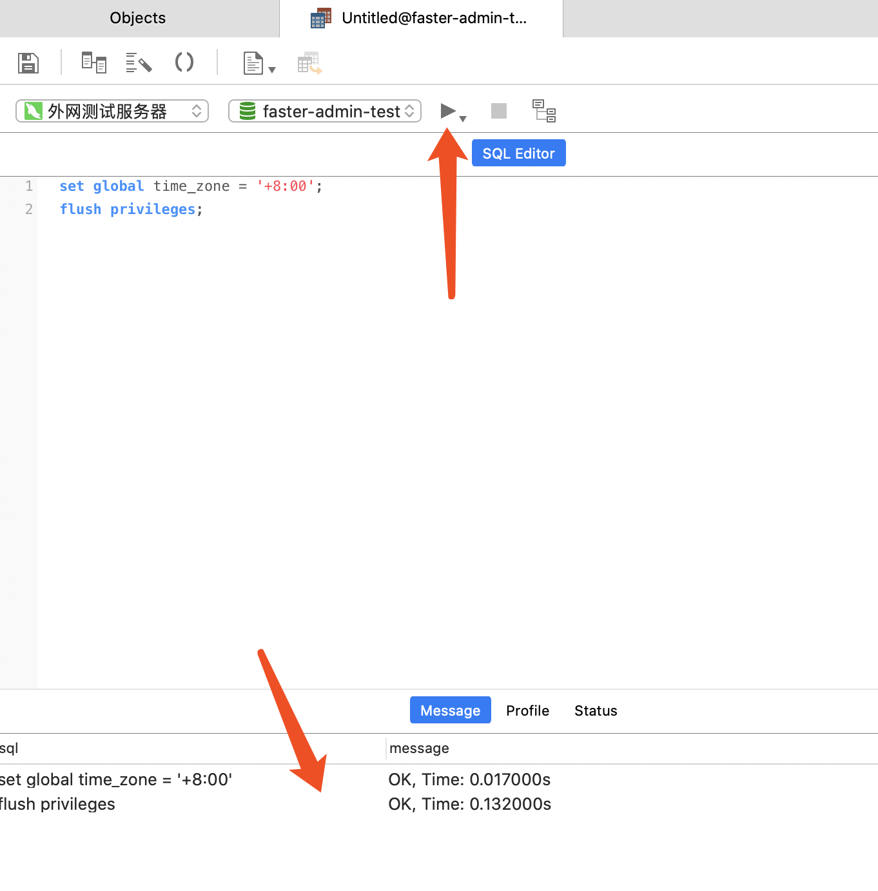

# 数据库初始化

首先，我们需要初始化数据库，您需要打开faster-admin-db文件夹。

之后您将看到如下文件：




我们需要将两个sql文件导入到数据库中。

## 数据库创建

导入前我们需要先创建一个数据库，此处我使用navicat来创建数据库，您可以选择使用其他工具。




点击新建数据库，按照如下内容填写：




之后点击OK，创建成功。

在新建的数据库上右键，选择导入文件。




首先选择base.sql，点击start开始导入，出现如下内容表示导入成功。




接下来再导入faster-admin-db.sql。


## 时区设置

请注意，我们需要使用GMT+8的时区，所以我们需要运行如下命令：

```
set global time_zone = '+8:00';
```

```
flush privileges;
```

以navicat为例，操作如下：

打开脚本编辑器




运行脚本：




## 总结

至此，数据库初始化完成。