# 接口服务启动

数据库初始完成后，我们便可以导入项目，运行我们的服务端了。

## IDEA导入项目

我们使用IDEA导入项目。

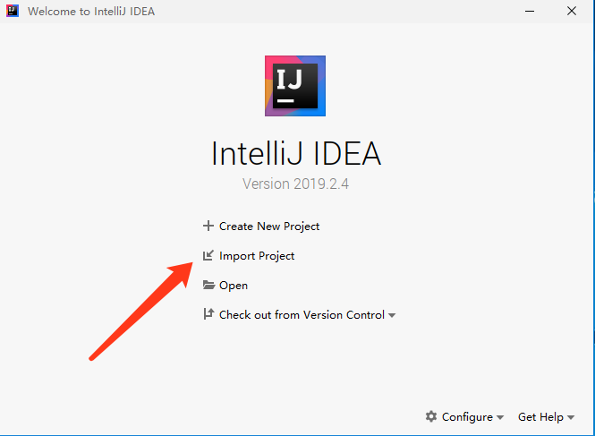

在弹出的对话框中选择我们的faster-admin-api目录，点击OK。

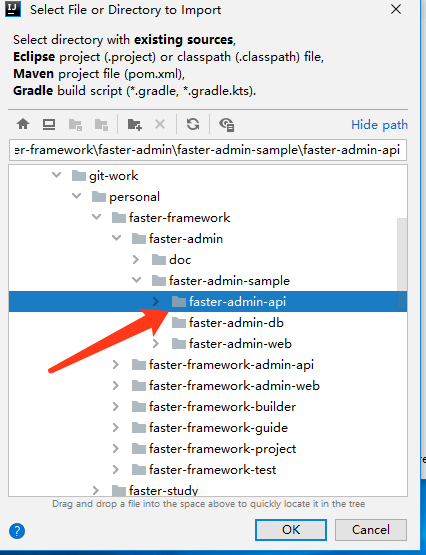

在弹出的对话框中，选择Maven，点击next。

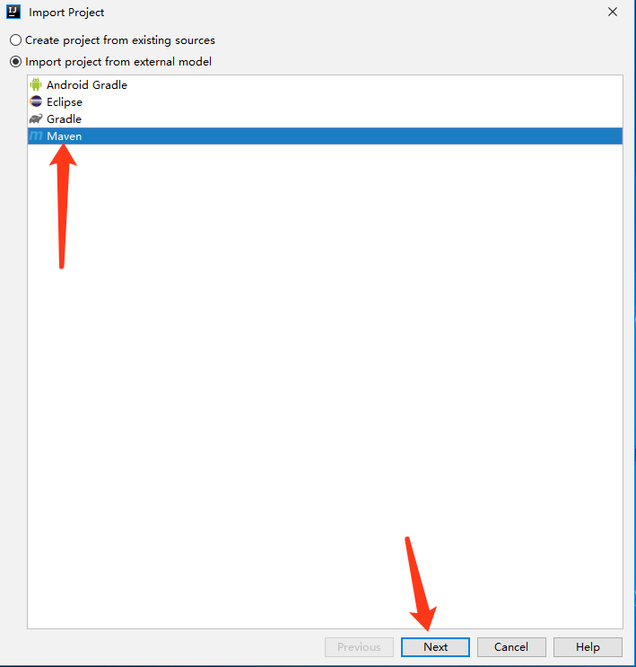

勾选自动导入maven依赖，点击next。

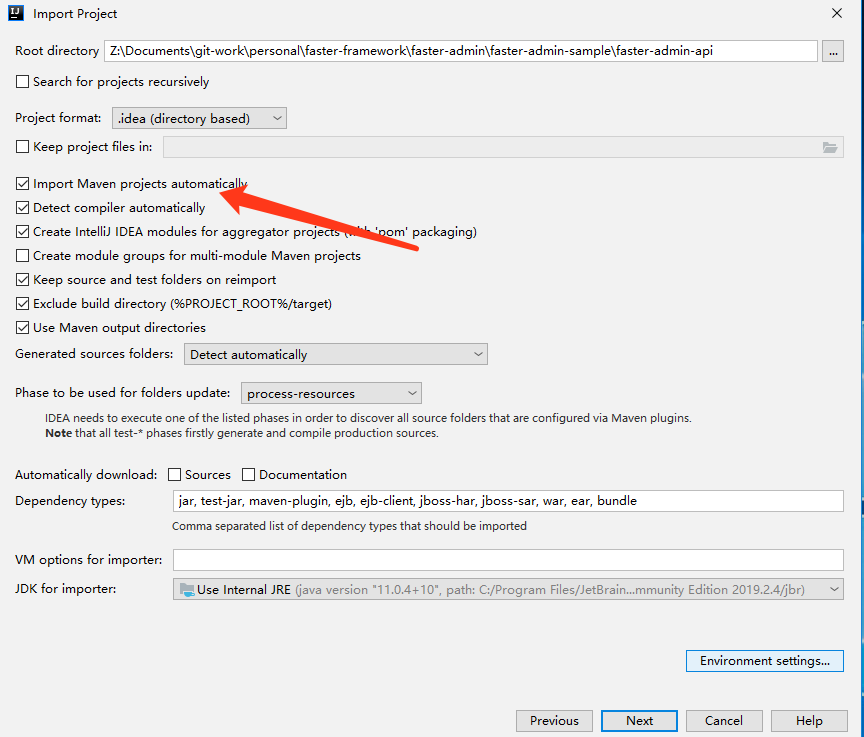

IDEA会自动扫描我们的pom.xml文件，继续点击next。

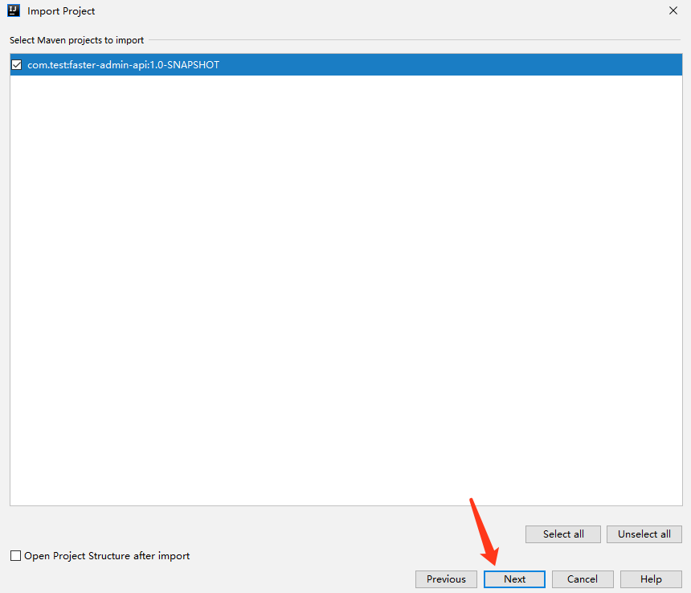

点击增加我们自己配置的JDK目录。

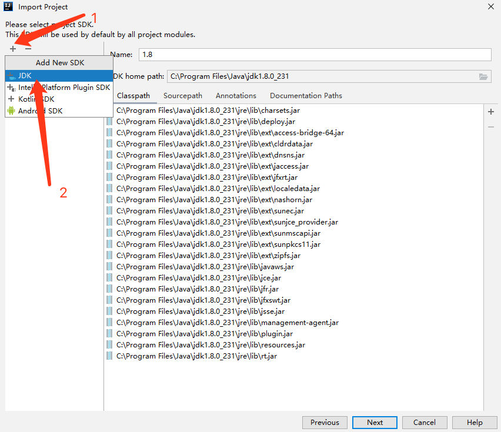

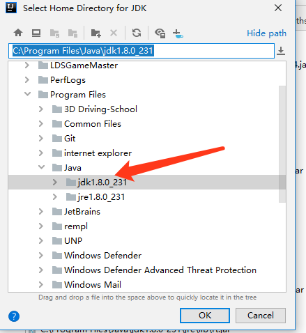

点击ok后，点击next，如果本身存在一个java环境，可以删除掉，因为可能是idea内置的java环境。

最后点击finish即完成项目导入。

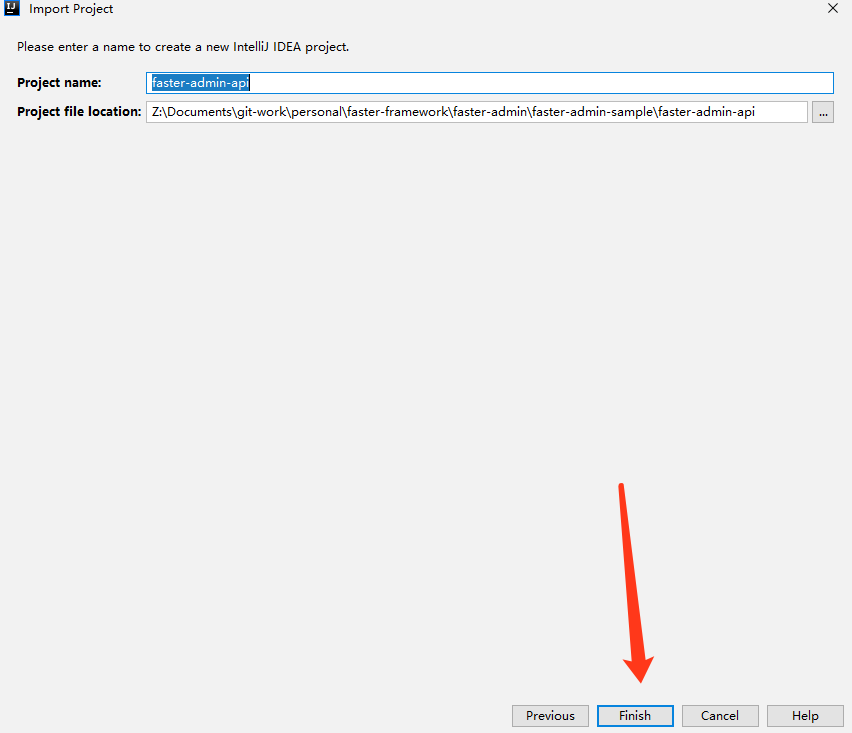

项目打开后，会自动下载maven所需要的依赖，等待下载完毕即可。

下载完成后，左侧才会出现项目文件,请耐心等待。

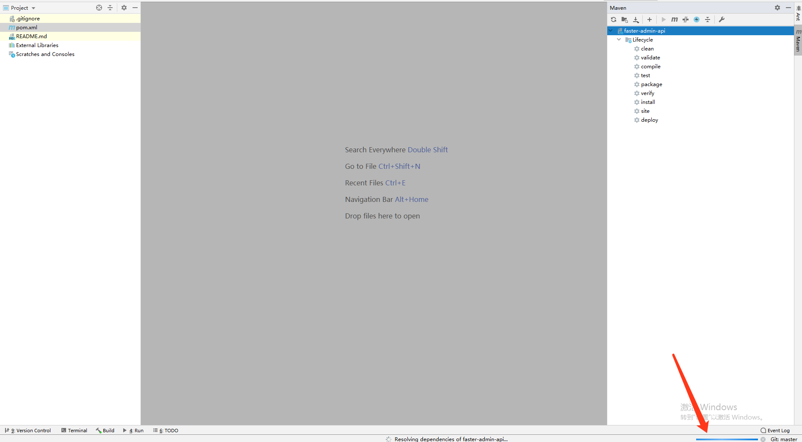

## 配置修改

项目初始化完毕后，我们需要修改数据库配置。

打开/src/main/resources目录下的application-local.yml文件。填充我们的数据库配置。

并且打开图片上传的配置，修改一下file-dir后面的内容，设置一个您喜欢的文件存储目录。

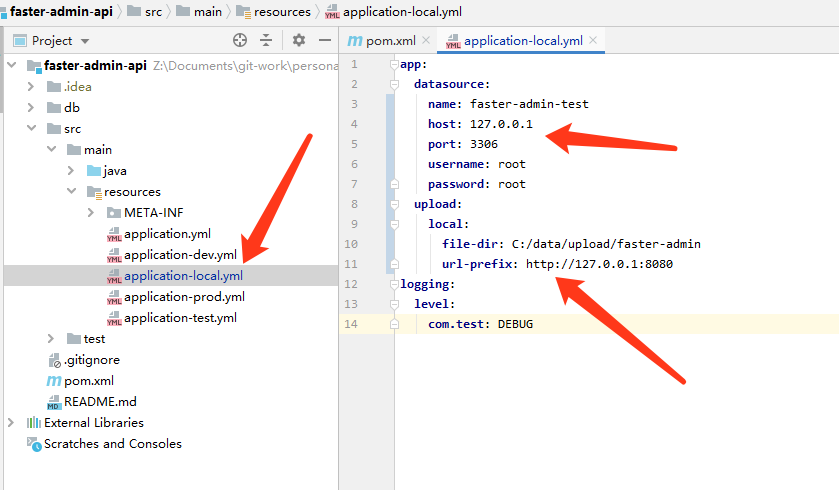

## 项目启动

接下来，我们打开com.test包，右键Application，选择Run Application.main即可。

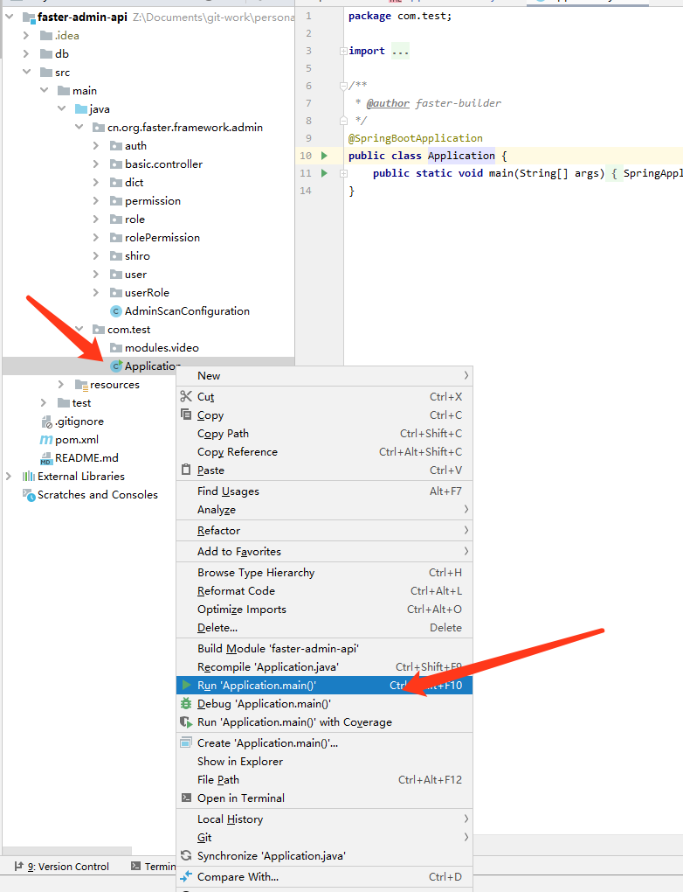

如果您一步步按照我们的教程操作，那么程序将会运行成功，出现以下页面。

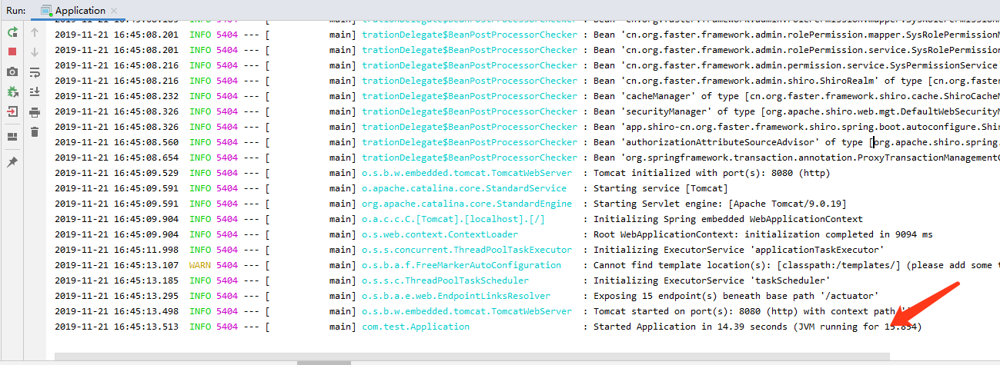

## 总结

至此，我们的接口端项目启动完毕。
