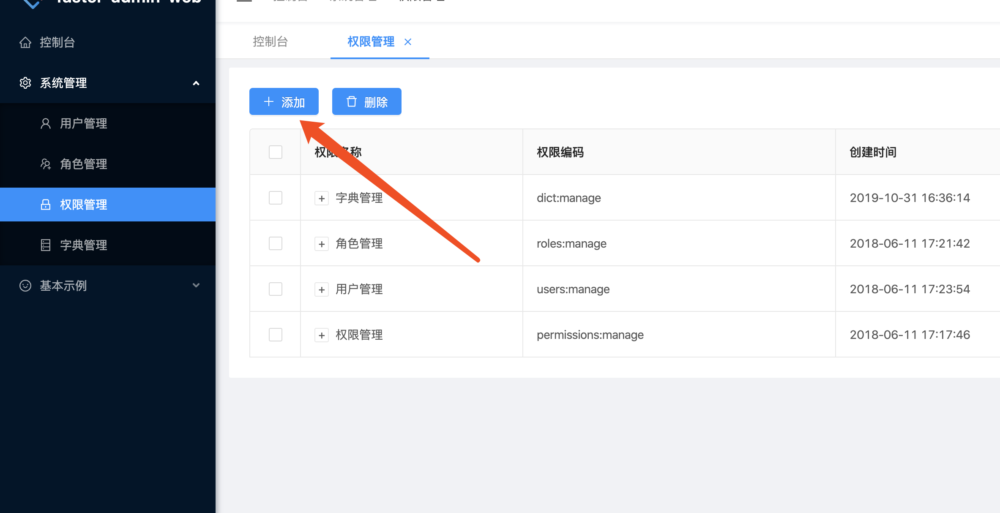
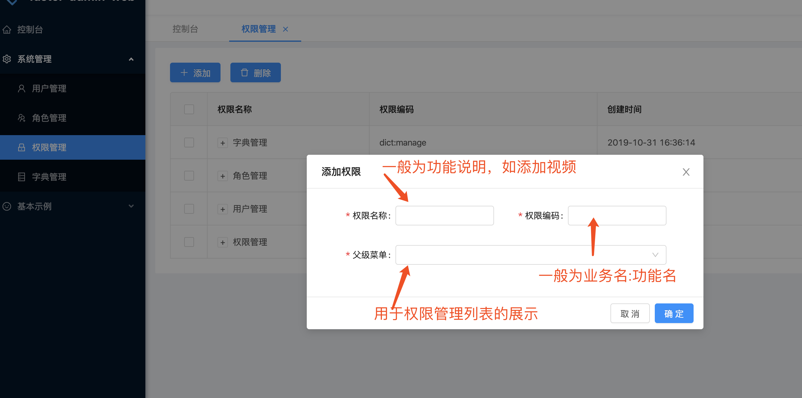

# 权限

系统中的权限分为菜单权限、按钮权限。

## 菜单权限
菜单权限配置在router-modules.js中，如果包含authority字段，即为菜单权限。

## 按钮权限
按钮权限主要控制页面中的某个按钮的隐藏与显示，当当前登录用户包含该权限时即显示，否则隐藏。

我们需要引入Permission标签。示例如下：

```
import Permission from '@/common/components/Permission';

<Permission authority="video:add">
    <Button type="primary" icon="plus" onClick={() => this.refs.addModal.show()}>添加</Button>
</Permission>
```

Permission标签中的authority为权限代码。

## 权限的配置
如果您使用代码生成器，默认情况下会生成基本的增删改查权限。
如果您不使用代码生成器或者需要自己新增功能权限。
那么您需要在系统管理->权限管理中配置权限。

如下图所示：






