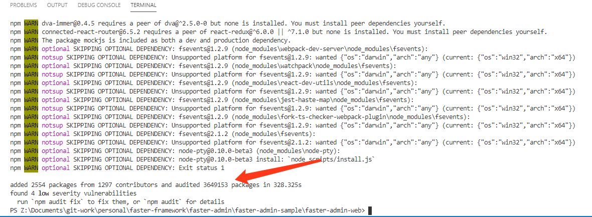

# 启动页面

接口已经部署完毕，接下来我们仅剩下最后一步，就是启动我们的前端页面。

## 安装依赖

我们需要使用vscode打开我们的faster-admin-web目录。


接下来我们打开终端：


在终端上运行以下命令安装依赖，并且等待其安装完成：

```
npm install
```


 web项目的依赖甚至要比后端项目还要庞大，所以需要一点耐心等待，安装完成后的界面如下：
 
 
 
 接下来，我们运行一下命令启动：
 
 ```
 npm run dev
 ```
 
 启动成功后，浏览器会自动打开，并进入登录页面：
 
 
 
 默认的账号密码均为admin，点击登录进入主页。
 
 
 ## 总结
 
 至此，我们的整套faster-admin启动完毕，进入主页面后您可以看到控制台、系统管理、基本示例、视频管理几个功能。
 
 其中基本示例，需要使用mock的方式运行才可以查看，可以关闭现有的npm命令，在命令行中输入以下命令启动mock。
 
 ```
 npm run mock
 ```
 